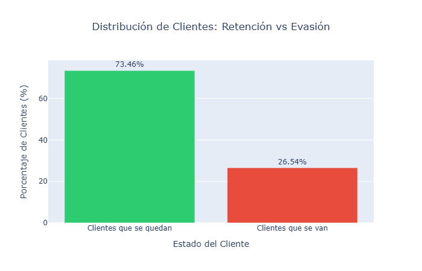
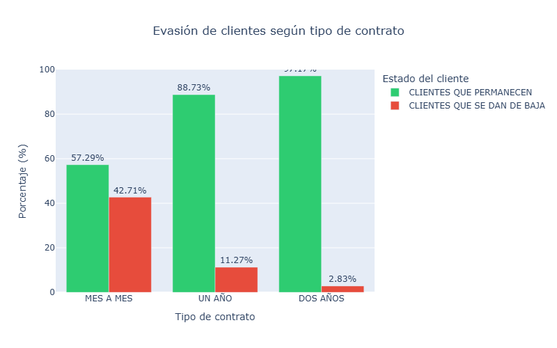
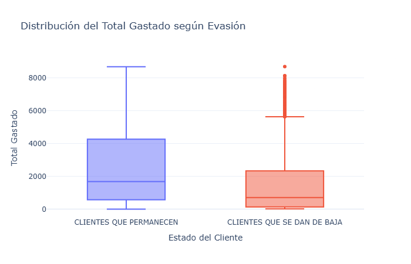

# 📊 Challenge TelecomX LATAM – Análisis de Evasión de Clientes (Churn)
[](https://colab.research.google.com/github/solanomillo/Challenge-TelecomX_LATAM/blob/main/TelecomX_LATAM.ipynb)
## ▶️ Ejecución rápida en Google Colab

1. Haz clic en el badge **Open in Colab**.
2. Ejecuta todas las celdas desde **Runtime → Run all**.
3. Explora el análisis, visualizaciones e insights directamente en el notebook.

No se requiere instalación local ni configuración adicional.


---

## 📌 Descripción del Proyecto

Este proyecto forma parte del **Challenge TelecomX LATAM**, cuyo objetivo es analizar el fenómeno de **evasión de clientes (Churn)** en una empresa de telecomunicaciones.

A través del análisis de datos y visualizaciones, se identifican **patrones de comportamiento**, **factores de riesgo** y **oportunidades estratégicas** que permiten reducir la pérdida de clientes y mejorar la retención.

El análisis fue desarrollado en un **notebook de Google Colab**, combinando limpieza de datos, análisis exploratorio, visualización y generación de insights accionables.

---

## 🎯 Objetivos del Análisis

- Analizar el comportamiento de clientes que **permanecen** y los que **se dan de baja**
- Evaluar el impacto de:
  - Antigüedad del cliente (Tenure)
  - Cargos mensuales y totales
  - Cantidad de servicios contratados
- Identificar relaciones y correlaciones entre variables
- Generar conclusiones estratégicas basadas en datos

---

## 🧠 Metodología de Trabajo

### 1️⃣ Limpieza y Tratamiento de Datos
- Importación del dataset
- Corrección de tipos de datos
- Manejo de valores faltantes
- Transformación de variables categóricas

### 2️⃣ Análisis Exploratorio de Datos (EDA)
- Estadísticas descriptivas por grupo de churn
- Comparación de cargos mensuales y totales
- Análisis de antigüedad del cliente
- Evaluación del impacto de la cantidad de servicios

### 3️⃣ Visualización de Datos
- Gráficos de barras comparativos
- Boxplots para análisis de distribución
- Gráficos de dispersión
- Storytelling orientado a negocio

### 4️⃣ Análisis de Correlación (Extra)
- Matriz de correlación entre variables numéricas
- Identificación de factores relacionados con la evasión
- Base para futuros modelos predictivos

---

## 📊 Visualizaciones


Estas imágenes refuerzan los análisis y conclusiones del proyecto.







---

## 🧩 Principales Insights

- Los clientes con **altos cargos mensuales** presentan mayor probabilidad de churn
- La **baja antigüedad** es uno de los factores más críticos en la evasión
- A mayor **cantidad de servicios contratados**, menor tasa de churn
- Los clientes con pocos servicios y altos costos representan el **mayor riesgo**
- Las correlaciones identificadas permiten avanzar hacia modelos predictivos

---

## 🚀 Recomendaciones Estratégicas

- Implementar acciones de retención durante los primeros meses del cliente
- Crear planes combinados que incentiven la contratación de múltiples servicios
- Ofrecer beneficios personalizados a clientes con cargos elevados
- Utilizar estos resultados como base para modelos de Machine Learning

---

## 🛠️ Tecnologías Utilizadas

- **Python**
- **Pandas**
- **Plotly**
- **Seaborn**
- **Matplotlib**
- **Jupyter / Google Colab**

---

## 📁 Estructura del Proyecto
```text
challenge-TelecomX_LATAM/
│
├── challenge_telecomx.ipynb
├── README.md
├── LICENSE
└── screenshots/
```

---

## 👤 Autor

**Julio Solano**  
📊 Data Analyst | Python | Visualización de Datos  

🔗 **LinkedIn:** [https://www.linkedin.com/in/julio-solano ](https://www.linkedin.com/public-profile/settings?lipi=urn%3Ali%3Apage%3Ad_flagship3_profile_self_edit_contact-info%3BcERHn4ihQR%2Bh5IX1qxxQWw%3D%3D) 

💻 **GitHub:** [https://github.com/juliosolano ](https://github.com/solanomillo/Challenge-TelecomX_LATAM/new/main?filename=README.md) 

📍 Argentina

---

## 📌 Sobre este proyecto

Este proyecto fue desarrollado como parte de un desafío de análisis de datos, con un enfoque profesional orientado a:

- Resolución de problemas de negocio
- Análisis exploratorio profundo
- Comunicación clara de insights
- Storytelling con datos
- Buenas prácticas de visualización

Representa un ejemplo práctico de cómo transformar datos en **decisiones estratégicas**, aplicando herramientas utilizadas en entornos reales de trabajo.

---

## 📜 Licencia

Este proyecto se distribuye bajo la **Licencia MIT**.  
Consulta el archivo [LICENSE](LICENSE) para más información.

---

✨ *Proyecto desarrollado con enfoque analítico, visual y orientado a negocio.*

⭐ Si este proyecto te resultó útil o interesante, no dudes en dejar una estrella en el repositorio.


